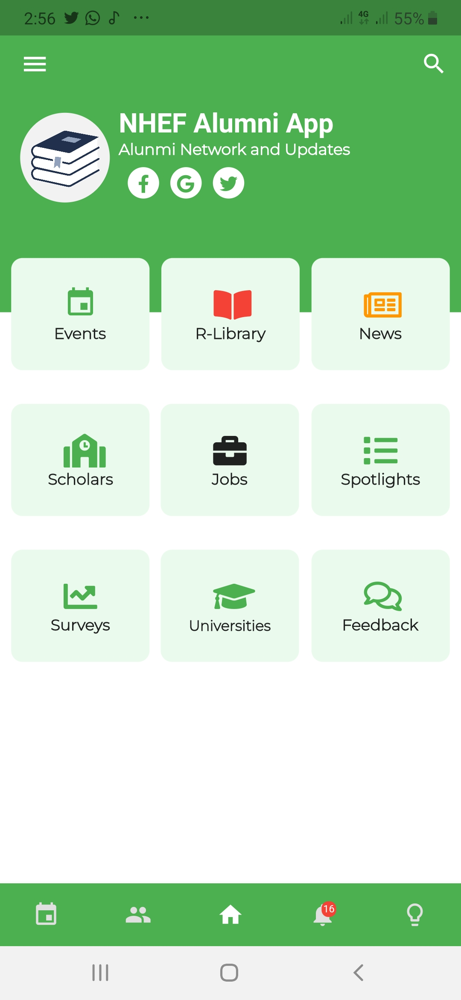
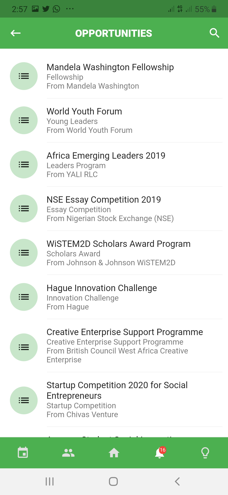

# NHEF Application Challenge

A Cross Platform Mobile Application for NHEF Application Challenge

>SCREEN SHOTS

<table><tr>
  <td style="text-align: center">
  
</td>
  <td style="text-align: center">
  
</td>
<td style="text-align: center">

</td>
  <td style="text-align: center">

</td>
</tr></table>

## Application Features

The Application contains the following source codes:

- Community for Scholars and Mentors
- Events Calendar
- Program Resource Library
- Surveys and Testimonials
- Job and Internship Postings

## Download App

Click the [DOWNLOAD APP](https://github.com/Timtech4u/nhef-app-challenge/blob/master/NHEF%20app.apk) to download the .apk version of the app.

[DOWNLOAD APP](https://github.com/Timtech4u/nhef-app-challenge/blob/master/NHEF%20app.apk)

## Admin Dashboard
 
The Application fetches data from an Admin Dashboard.
 
[Visit Admin Dashboard](https://nhef.herokuapp.com)
Username: `admin`
Password: `pass1234`

  ### Dashboard Features
  - Create, Read, Update, Delete data for all Application Features
  - Export data for Application Features
  - Import data for Application Features
  - Create extra Admin accounts
  - Saves assets to AWS

**[API Documentation](https://nhef.herokuapp.com/api/docs/)**

### Application Features still in progress
-  Scholar Login and Profile
-  Scholar Social Features 
-  Survey Responses Form
-  Event Calendar implementation

